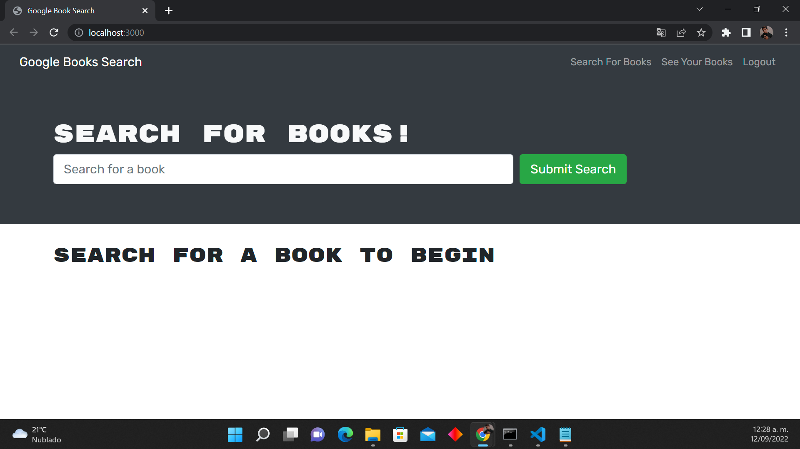
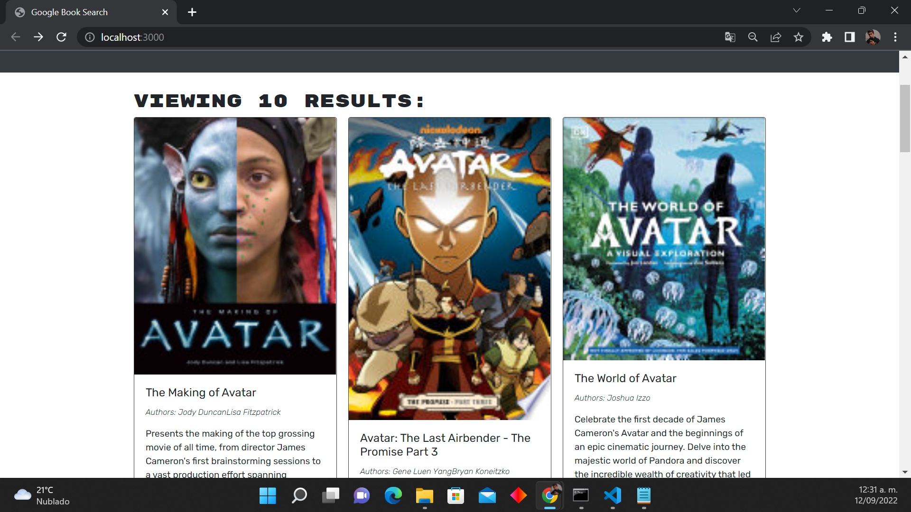

# MERN-Book-Search-Engine

[](https://github.com/israel2800)
[](https://github.com/israel2800/MERN-Book-Search-Engine)
[](https://github.com/israel2800/MERN-Book-Search-Engine)
[](https://nodejs.org/en/)
[](https://www.npmjs.com/package/inquirer)
[](https://choosealicense.com/licenses/mit/)

## Table of Content
* [ Project Links ](#Project-Links)
* [ Screenshots-Demo ](#Screenshots)
* [ Project Objective ](#Project-Objective)
* [ User Story ](#User-Story)
* [ Technologies ](#Technologies)
* [ Installation ](#Installation)
* [ Usage ](#Usage)
* [ Credits and Reference ](#Credits-and-Reference)
* [ Tests ](#Tests)
* [ Author Contact ](#Author-Contact)
* [ License ](#License)


##  Project Links

Web application link:
https://book-engine-searcher.herokuapp.com/

GitHub project:
https://github.com/Israel2800/MERN-Book-Search-Engine

## Screenshots-Demo

**Books searcher:**



**Results of a book search:**




## Project Objective
To create a website that allows users to save their favorite books for future reading or interest. Users will be able to search for a specific book and save the cover, the title and a short description of the book into their own account!

## User Story
```
AS AN avid reader,
I WANT to search for new books to read,
SO THAT I can keep a list of books to purchase.
```

## Technologies 
```
Node.js, JavaScript, HTML, CSS, Express, MongoDB, Mongoose, React, GraphQL API
```

## Installation
Access to the GitHub project and clone or download the project, you can do this by clicking in the green button with the word "Code". If you decided to clone the repo you need to choose one of the SSH/HTTPS keys and copy one, after this you will need to open the terminal of your choice and type "git clone 'key'" you will need to paste one of the two keys you previously select and then click enter. If you decided to download the project you will click in the "Download.zip" option and the project will be downloaded so you will locate the file and do a right-click to select "Extract All" and you can choose where tu place it.

## Usage 
To use this app you will need to download and install the Terminal for Mac or GitBash for Windows. You may also need to install [node.js](https://nodejs.org/en/) and [npm](https://www.npmjs.com/). You will open the project in the code editor of your choice and then open the terminal and type "npm install" or "npm i" to install all the dependencies required. Finally you will be able to start the project typing "npm start" on your terminal or GitBash. And that is it, now you are able to test the code with insomnia!

## Credits and Reference
The following links helped me with the project: [Mongoose](https://www.npmjs.com/package/mongoose) and [Express](https://www.npmjs.com/package/express).

## Tests
npm test

## Author Contact
Contact the author with any questions!<br>
Github link: [Israel2800](https://github.com/israel2800)<br>
Email: dady281100@gmail.com

## License
This project is [MIT](https://choosealicense.com/licenses/mit/) licensed.<br />

Copyright © 2022 [ISRAEL AGUILAR](https://github.com/israel2800)

<hr>
<p align='center'><i>
This README was generated with ❤️ by ISRAEL AGUILAR
</i></p>

